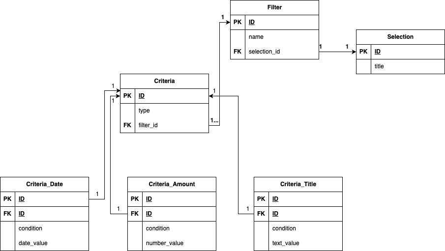

# Back-end. Filters App (Askend test assignment)

## Requirements

* JDK 21
* Docker v20

## Structure of the source code

### Source code layers

* config - configuration layer, provides configurations for application
* controller - controller layer, accepts REST requests
* entity - contains entity classes
* enums - holds enumerated value classes
* exceptions - layer that contains exception handling objects
* mapper - contains mapper interfaces to map entity-to-domain and domain-to-entity
* model - model layer, contains the structure of models (domains) used throughout the application
* repository - layer with repository interfaces to get data from the database
* service - service layer, responsible for business logic
* util - helper layer, includes commonly used functionality and app constants
* validation - layer that contains validation handling

## Application configurations

Configuration file [application.yaml](src/main/resources/application.yaml),
with **environmental** variables

* `APP_PORT` - Java application port
* `APP_DB_HOST` - database connection host
* `APP_DB_PORT` - database connection port
* `APP_DB` - database schema name
* `APP_DB_USER` - database user username
* `APP_DB_PASSWORD` - database user password

## Database

Given project uses relational database PostgreSQL. Database schema, including necessary tables and constraints is
being generated automatically on application startup. Java library Hibernate helps with correct detection of
object-entity relations.

### Database schema



## Database migration
As a database migration tool is used Flyway. Migrations are located under `flyway/migration` package
and file naming is structured as `V1__name`, where `V1` indicates the new version of the database that changes bring.

## Installation guide

Application is being built as `Docker image`.

```sh
docker build --no-cache -t filters-app-backend .
```

## Building

### Building application
To build the latest version of the application:
```sh
./gradlew build
```

### Building application together with `Docker` image
There is also an option use `Gradle`'s functionality to build `Docker` image of the application using `Gradle task`
named `bootBuildImage`. This task also allows to upload the image to `DockerHub registry` using ` docker { publishRegistry {...} }`
block by providing `DockerHub` credentials, but in this particular project this is not used.
Application is running as `Docker` container along with corresponding _Gradle_ parameters as _properties_.

### Docker container parameters

* `imageNameProp` - name of application container

### Building application Docker container with commands
Image building

```sh
./gradlew bootBuildImage -x test -PimageName=filters-app-backend
```

## Running application locally

**NB!** It is recommended to run PostgreSQL database in Docker container before running the application.

Run the command:
```sh
./gradlew bootRun
```

## Using application locally
To use application by URL on local machine, the application is accessible by `http://localhost:8081/api` URL.
Application can be used locally either by running application itself or using `Docker` container.

## Application healthcheck
In order to make sure what is the status of the application, is it up and running etc., the Spring Boot framework's
library Actuator is being used. It makes possible to navigate by `app-url/actuator/health` (e.g. regarding
this specific project and running locally `http://localhost:8081/api/actuator/health`) and get the information.
This provides the data about application's current status, is application up or down, what is the version of the application etc.

## Swagger UI
It is also possible to observe API endpoints with Swagger tool. The Swagger page can be accessed locally
using URL `http://localhost:8081/api/swagger-ui/index.html`.

## Running tests
There are both unit and integration tests written. Since integration tests require connection to the database,
the `Test Containers` library is being used to set PostgreSQL container up only during running tests, so that
it would not be necessary to start the real database up. To write test scenarios, `Jupiter` library is used,
as well as `WebMVC` to emulate REST requests and `Mockito` to imitate beans.

Run the command:

```sh
./gradlew test
```

